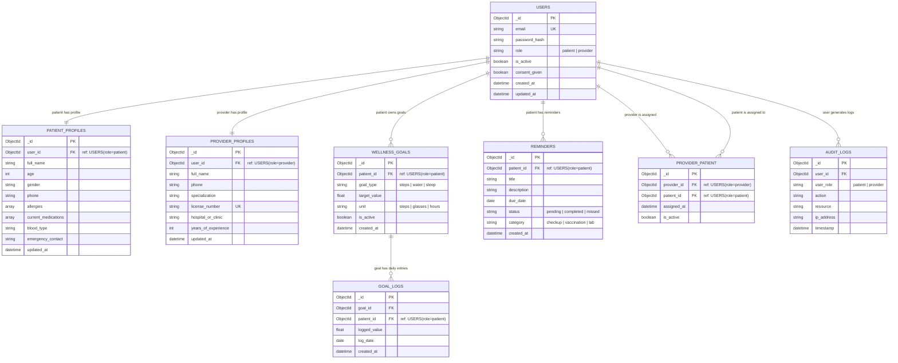

# 🏥 HealthGuard — Wellness & Preventive Care Portal

> A full-stack preventive healthcare portal built with **FastAPI**, **React**, and **MongoDB** — designed to help patients track wellness goals, manage preventive care reminders, and enable healthcare providers to monitor patient compliance.


## Overview

HealthGuard is an MVP healthcare wellness portal developed for a 5-hour hackathon. It empowers patients to manage their health proactively through:

- Tracking daily wellness activities (steps, hydration, sleep)
- Receiving preventive care reminders
- Managing personal health profiles
- Connecting with assigned healthcare providers

Healthcare providers can monitor patient compliance, view wellness goal progress, and ensure patients stay on track with preventive checkups.

---

## Tech Stack

| Layer       | Technology            |
|-------------|-----------------------|
| Frontend    | React (Vite), CSS Modules |
| Backend     | Python FastAPI        |
| Database    | MongoDB (via Motor async driver) |
| Auth        | JWT (python-jose), bcrypt |
| Cloud       | Render / Railway (backend), Vercel (frontend) |
| CI/CD       | GitHub Actions        |
| API Style   | RESTful               |

---

## System Architecture

```
┌────────────────────────────────────────┐
│             React Frontend             │
│    (Patient Dashboard, Provider View)  │
└──────────────────┬─────────────────────┘
                   │ REST API (HTTPS)
┌──────────────────▼─────────────────────┐
│           FastAPI Backend              │
│  Auth │ Profiles │ Goals │ Reminders   │
└──────────────────┬─────────────────────┘
                   │ Motor (async)
┌──────────────────▼─────────────────────┐
│               MongoDB                  │
│  users │ patient_profiles              │
│  provider_profiles │ wellness_goals    │
│  goal_logs │ reminders │ audit_logs    │
└────────────────────────────────────────┘
```

---

## Database Design

### Collections Overview

| Collection           | Owned By  | Purpose                                                  |
|----------------------|-----------|----------------------------------------------------------|
| `users`              | Both      | Auth credentials and `role` field for all users          |
| `patient_profiles`   | Patient   | Health info — allergies, medications, blood type, etc.   |
| `provider_profiles`  | Provider  | Professional info — specialization, license, clinic, etc.|
| `wellness_goals`     | Patient   | Goal definitions per patient (steps, water, sleep)       |
| `goal_logs`          | Patient   | Daily activity entries logged by patients                |
| `reminders`          | Patient   | Preventive care reminders (checkups, vaccinations)       |
| `provider_patient`   | Both      | Many-to-many mapping of providers to their patients      |
| `audit_logs`         | Both      | HIPAA-style access logging for all data actions          |

> **Role distinction:** A single `USERS` collection stores credentials for everyone.
> The `role` field (`patient` | `provider`) determines which profile collection
> is populated on registration and which dashboards and API routes are accessible.

---

### Schema Details

#### `users`
```json
{
  "_id": "ObjectId",
  "email": "string (unique, indexed)",
  "password_hash": "string (bcrypt)",
  "role": "enum: ['patient', 'provider']",
  "is_active": "boolean",
  "consent_given": "boolean",
  "created_at": "datetime",
  "updated_at": "datetime"
}
```

> `role` is set at registration and cannot be changed.
> On successful registration the backend automatically creates either a
> `patient_profiles` or `provider_profiles` document linked to this user.

---

#### `patient_profiles`
> Created automatically when a user registers with `role = patient`.

```json
{
  "_id": "ObjectId",
  "user_id": "ObjectId (ref: users where role=patient)",
  "full_name": "string",
  "age": "integer",
  "gender": "string",
  "phone": "string",
  "allergies": ["string"],
  "current_medications": ["string"],
  "blood_type": "string",
  "emergency_contact": "string",
  "updated_at": "datetime"
}
```

---

#### `provider_profiles`
> Created automatically when a user registers with `role = provider`.

```json
{
  "_id": "ObjectId",
  "user_id": "ObjectId (ref: users where role=provider)",
  "full_name": "string",
  "phone": "string",
  "specialization": "string (e.g. 'Cardiology', 'General Practice')",
  "license_number": "string (unique)",
  "hospital_or_clinic": "string",
  "years_of_experience": "integer",
  "updated_at": "datetime"
}
```

---

#### `wellness_goals`
```json
{
  "_id": "ObjectId",
  "patient_id": "ObjectId (ref: users where role=patient)",
  "goal_type": "enum: ['steps', 'water', 'sleep']",
  "target_value": "float",
  "unit": "enum: ['steps', 'glasses', 'hours']",
  "is_active": "boolean",
  "created_at": "datetime"
}
```

#### `goal_logs`
```json
{
  "_id": "ObjectId",
  "goal_id": "ObjectId (ref: wellness_goals)",
  "patient_id": "ObjectId (ref: users where role=patient)",
  "logged_value": "float",
  "log_date": "date (YYYY-MM-DD)",
  "created_at": "datetime"
}
```

#### `reminders`
```json
{
  "_id": "ObjectId",
  "patient_id": "ObjectId (ref: users where role=patient)",
  "title": "string",
  "description": "string",
  "due_date": "date",
  "status": "enum: ['pending', 'completed', 'missed']",
  "category": "enum: ['checkup', 'vaccination', 'lab']",
  "created_at": "datetime"
}
```

#### `provider_patient`
```json
{
  "_id": "ObjectId",
  "provider_id": "ObjectId (ref: users where role=provider)",
  "patient_id": "ObjectId (ref: users where role=patient)",
  "assigned_at": "datetime",
  "is_active": "boolean"
}
```

#### `audit_logs`
```json
{
  "_id": "ObjectId",
  "user_id": "ObjectId (ref: users)",
  "user_role": "enum: ['patient', 'provider']",
  "action": "string (e.g., 'VIEW_PROFILE', 'UPDATE_GOAL')",
  "resource": "string (e.g., 'patient_profiles', 'wellness_goals')",
  "ip_address": "string",
  "timestamp": "datetime"
}
```

---

### ER Diagram

> Rendered natively by GitHub — no plugins needed.
>
> **How to read roles:** `USERS` is one collection for everyone. `role = patient`
> links to `PATIENT_PROFILES`, wellness data, and reminders. `role = provider`
> links to `PROVIDER_PROFILES` and patient assignments via `PROVIDER_PATIENT`.



**Indexes:**
- `users.email` — unique index
- `users.role` — index for role-based filtering at the API layer
- `patient_profiles.user_id` — unique index (one profile per patient)
- `provider_profiles.user_id` — unique index (one profile per provider)
- `provider_profiles.license_number` — unique index
- `goal_logs.patient_id + log_date` — compound index for dashboard queries
- `reminders.patient_id + due_date` — compound index for upcoming reminder queries
- `audit_logs.user_id + timestamp` — compound index for audit trail queries
- `provider_patient.provider_id + patient_id` — compound unique index to prevent duplicate assignments

---

## Features

### Patient Features
- **Secure Registration & Login** — JWT-based auth with bcrypt password hashing and consent checkbox
- **Patient Dashboard** — real-time wellness goal progress (steps, water, sleep) and upcoming preventive reminders
- **Goal Tracker** — log daily activity entries and visualize progress toward targets
- **Health Profile** — view and update personal info, allergies, and current medications
- **Health Tip of the Day** — static curated tips displayed on the dashboard

### Provider Features
- **Provider Dashboard** — list of all assigned patients with compliance status
- **Patient Detail View** — drill into an individual patient's wellness goals and reminder compliance
- **Compliance Indicators** — visual status per patient (goal met, missed checkup, on track)

### Public (No Login Required)
- **Public Health Info Page** — COVID-19 updates, flu prevention, mental health awareness
- **Privacy Policy** — transparent data handling disclosure

---

## API Endpoints

### Auth
| Method | Endpoint              | Description                    |
|--------|-----------------------|--------------------------------|
| POST   | `/api/auth/register`  | Register patient or provider   |
| POST   | `/api/auth/login`     | Login and receive JWT token    |
| POST   | `/api/auth/logout`    | Invalidate session             |

### Patient Profile
| Method | Endpoint                    | Description                     |
|--------|-----------------------------|---------------------------------|
| GET    | `/api/patient/profile/me`   | Get current patient's profile   |
| PUT    | `/api/patient/profile/me`   | Update patient profile          |

### Provider Profile
| Method | Endpoint                    | Description                      |
|--------|-----------------------------|----------------------------------|
| GET    | `/api/provider/profile/me`  | Get current provider's profile   |
| PUT    | `/api/provider/profile/me`  | Update provider profile          |

### Wellness Goals
| Method | Endpoint                      | Description                        |
|--------|-------------------------------|------------------------------------|
| GET    | `/api/goals`                  | List all goals for current patient |
| POST   | `/api/goals`                  | Create a new wellness goal         |
| POST   | `/api/goals/{id}/log`         | Log a daily activity entry         |
| GET    | `/api/goals/{id}/logs`        | Get history of logs for a goal     |

### Reminders
| Method | Endpoint                       | Description                              |
|--------|--------------------------------|------------------------------------------|
| GET    | `/api/reminders`               | List upcoming reminders for patient      |
| PUT    | `/api/reminders/{id}/status`   | Mark a reminder as completed or missed   |

### Provider
| Method | Endpoint                                     | Description                          |
|--------|----------------------------------------------|--------------------------------------|
| GET    | `/api/provider/patients`                     | List assigned patients               |
| GET    | `/api/provider/patients/{id}`                | View a specific patient's data       |
| GET    | `/api/provider/patients/{id}/compliance`     | View patient compliance summary      |

### Public
| Method | Endpoint                   | Description                     |
|--------|----------------------------|---------------------------------|
| GET    | `/api/public/health-info`  | Get public health info content  |

---

## Setup & Installation

### Prerequisites
- Python 3.11+
- Node.js 18+
- MongoDB Atlas account (or local MongoDB)

### Backend Setup

```bash
cd backend
python -m venv venv
source venv/bin/activate         # Windows: venv\Scripts\activate
pip install -r requirements.txt
uvicorn app.main:app --reload --port 8000
```

### Frontend Setup

```bash
cd frontend
npm install
npm run dev
```

The React app will be available at `http://localhost:5173`.

---

## Environment Variables

### Backend (`.env`)

```env
MONGODB_URL=mongodb+srv://<user>:<pass>@cluster.mongodb.net/healthguard
DATABASE_NAME=healthguard
JWT_SECRET_KEY=your-super-secret-key-here
JWT_ALGORITHM=HS256
JWT_ACCESS_TOKEN_EXPIRE_MINUTES=60
ENVIRONMENT=development
```

### Frontend (`.env`)

```env
VITE_API_BASE_URL=http://localhost:8000
```

---

## Authentication & Security

- **Password hashing** — bcrypt via `passlib`
- **JWT tokens** — signed HS256 tokens with expiry; `role` is embedded in the payload so every route can enforce access without an extra DB lookup
- **Role-based access control** — `patient` routes reject provider tokens and vice versa
- **Profile auto-creation** — on registration, backend creates the correct profile document (`patient_profiles` or `provider_profiles`) based on `role`
- **Consent on registration** — checkbox stored in `users.consent_given`
- **Audit logging** — every data read/write logs `user_id`, `user_role`, `action`, `resource`, and `ip_address` to `audit_logs`
- **HTTPS** — enforced in production via cloud platform
- **CORS** — restricted to frontend origin in production

---

## Team

| Name | Role |
|------|------|
| Varshan AVR (22BRS1060) | Backend (FastAPI) |
| Srinath Kamalakumar (22BCE1022) | Backend (FastAPI) |
| Nikhil Singh (22BEC1150) | Frontend (React) |
| Amirthakatesan (22BCE5212) | Frontend (React) |

---

## License

This project is developed as part of a hackathon MVP. All rights reserved.
